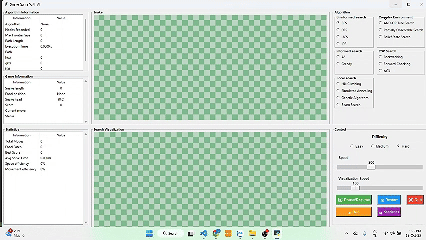
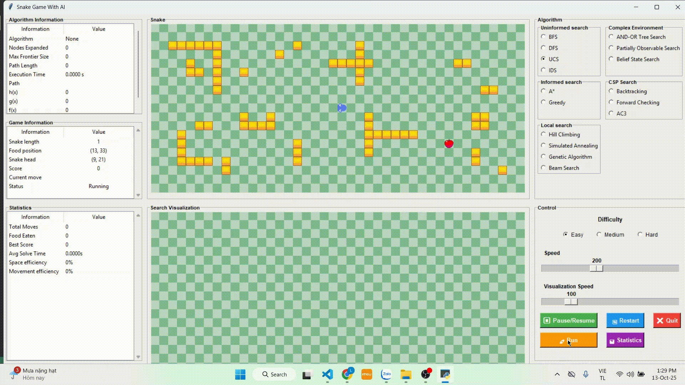
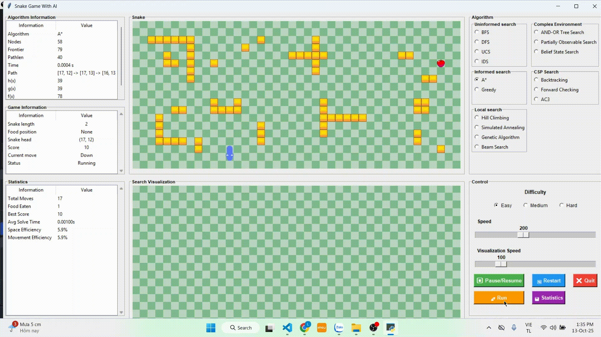
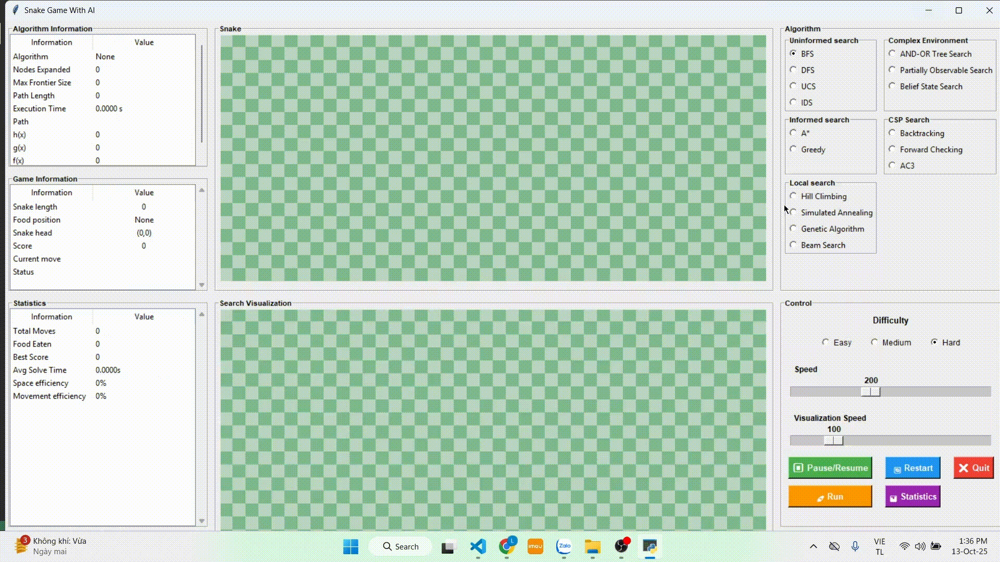
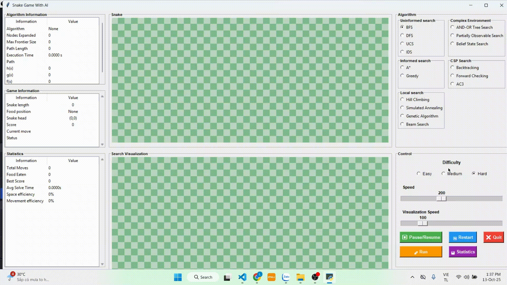
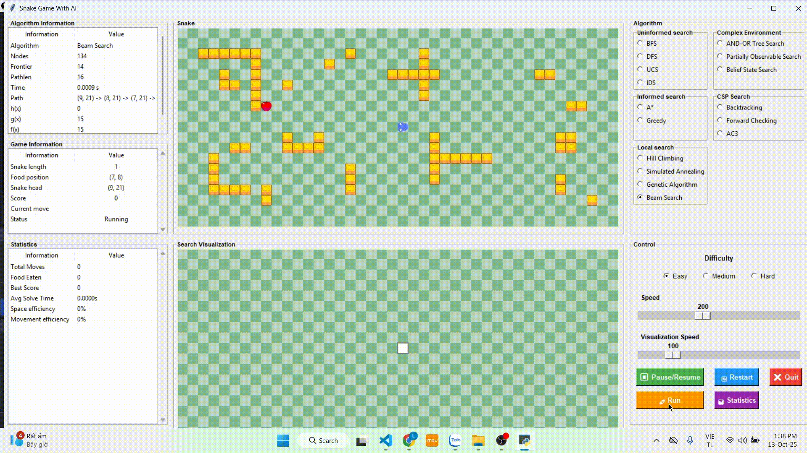
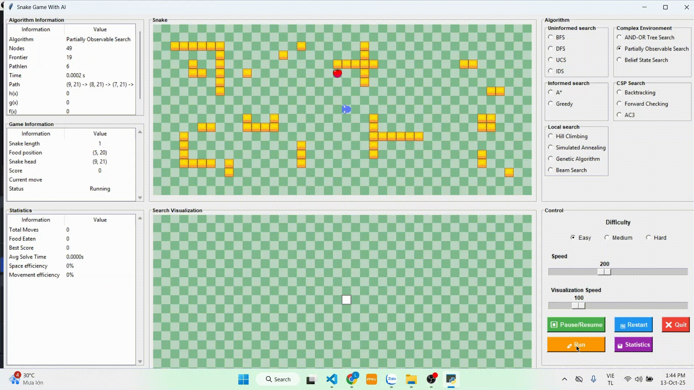
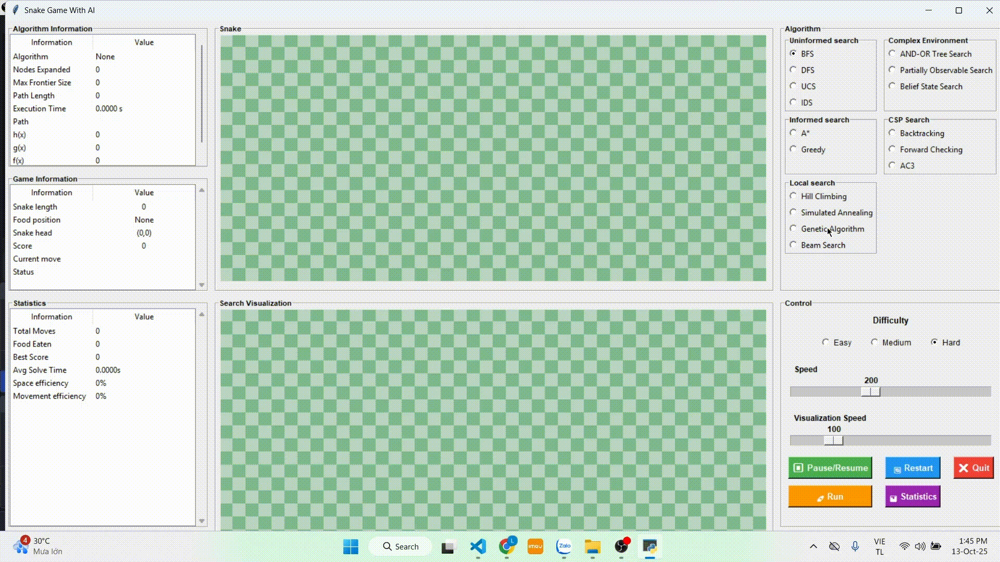

# ĐỒ ÁN MÔN HỌC: TRÍ TUỆ NHÂN TẠO
# Ứng dụng các thuật toán tìm kiếm trong trí tuệ nhân tạo vào Snake Game
## Thông tin đồ án
- **Môn học:** Trí tuệ nhân tạo
- **Giảng viên:** TS. Phan Thị Huyền Trang
- **Lớp học phần:** 251ARIN330585_05CLC
- **Nhóm:** 10
- **Thành viên:**
  - Ninh Anh Tú       23110168
  - Trần Hữu Lộc      23110123
  - Nguyễn Khánh      23110112
## Mục lục

## Tổng quan về Snake Game
### Lịch sử và nguồn gốc
Snake Game (trò chơi “Rắn săn mồi”) là một trò chơi cổ điển được phát triển từ những năm 1970 
và trở nên phổ biến rộng rãi trên các thiết bị di động Nokia vào cuối thập niên 1990. 
Mục tiêu của trò chơi là điều khiển con rắn di chuyển trên một bảng (grid) 
để ăn thức ăn, giúp rắn dài ra, đồng thời tránh va vào tường hoặc chính cơ thể nó.
### Quy tắc chơi và cách chơi
- Rắn bắt đầu với chiều dài ngắn (ví dụ 3 ô) ở giữa bảng.
- Thức ăn xuất hiện ngẫu nhiên.
- Mỗi lần rắn ăn, nó dài ra và thức ăn mới xuất hiện ở vị trí khác.
- Người chơi phải điều khiển rắn sao cho không tự cắn vào thân hoặc đụng tường.
- Trò chơi kết thúc khi rắn va chạm hoặc không còn chỗ để di chuyển.

## Tổng quan về dự án
### Mục tiêu
- Xây dựng một dự án hoàn chỉnh: Tạo ra trò chơi Snake, với giao diện trực quan,
các chức năng cơ bản như di chuyển, ăn thức ăn, tăng độ dài, tính điểm và xử lý va chạm.
- Triển khai các thuật toán tìm kiếm trong trí tuệ nhân tạo
- Đánh giá hiệu quả của các thuật toán:
Phân tích và so sánh các thuật toán dựa trên số nút mở rộng, kích thước hàng đợi cực đại (frontier size), thời gian thực thi, và độ dài đường đi tìm được.
- Thể hiện trực quan hoạt động của thuật toán: Minh họa quá trình tìm kiếm đường đi
của các thuật toán thông qua màu sắc, hoạt ảnh hoặc thông tin thống kê trên giao diện.
### Phạm vi
- Bảng 42x19
- Nhiều mức độ khó khác nhau
- Hệ thống theo dõi và phân tích hiệu suất

## Các thuật toán được sử dụng
### 1. BFS (Breadth-First Search)
- **Nguyên lý hoạt động:** BFS là thuật toán tìm kiếm theo chiều rộng.
Bắt đầu từ nút gốc, thuật toán duyệt tất cả các nút ở mức hiện tại trước, sau đó mới chuyển sang mức kế tiếp.
Sử dụng hàng đợi (queue) để lưu trữ các nút sẽ được mở rộng tiếp theo.
BFS đảm bảo tìm được đường đi ngắn nhất nếu chi phí giữa các cạnh bằng nhau.
- **Độ phức tạp thời gian:** 𝑂(𝑏^𝑑)
  - b: số nhánh trung bình
  - d: độ sâu của nút đích
- **Độ phức tạp không gian:** 𝑂(𝑏^𝑑)
  - Do phải lưu trữ toàn bộ các nút trong hàng đợi ở mỗi mức.
- **Ưu điểm:** Luôn tìm được đường đi ngắn nhất.
- **Nhược điểm:** Tốn bộ nhớ lớn vì phải lưu toàn bộ các nút ở mỗi mức, tốc độ chậm khi không gian trạng thái lớn.

### 2. Thuật toán DFS (Depth-First Search)
- **Nguyên lý hoạt động:** DFS là thuật toán tìm kiếm theo chiều sâu. Bắt đầu từ nút gốc, thuật toán duyệt sâu xuống nhánh đầu tiên cho đến khi gặp nút đích hoặc nút không thể mở rộng, sau đó quay lui (backtrack).
Sử dụng ngăn xếp (stack) để quản lý thứ tự mở rộng.
- **Độ phức tạp thời gian:** 𝑂(𝑏^𝑚)
  - b: số nhánh trung bình
  - m: độ sâu tối đa của không gian tìm kiếm
- **Độ phức tạp không gian:** 𝑂(𝑏^𝑚)
  - Vì chỉ lưu trữ các nút trên đường đi hiện tại.
- **Ưu điểm:** Tốn ít bộ nhớ hơn BFS. Có thể tìm lời giải nhanh nếu lời giải ở gần gốc và nằm ở nhánh đầu tiên.
- **Nhược điểm:** Không đảm bảo tìm được đường đi ngắn nhất. Dễ rơi vào vòng lặp vô hạn nếu không có kiểm tra trạng thái đã duyệt.

### 3. Thuật toán UCS (Uniform Cost Search) 
- **Nguyên lý hoạt động:** UCS là biến thể của BFS có trọng số, mở rộng nút có chi phí nhỏ nhất tính từ gốc đến nút hiện tại. Sử dụng hàng đợi ưu tiên (priority queue) để chọn nút có chi phí thấp nhất.
Bảo đảm tìm được đường đi tối ưu khi tất cả chi phí ≥ 0.
- **Độ phức tạp thời gian:** 𝑂(𝑏^(1+[𝐶∗/𝜖]))
  - 𝐶: chi phí tối ưu để đến đích
  - ϵ: chi phí nhỏ nhất giữa hai trạng thái
- **Độ phức tạp không gian:** Tương tự thời gian, vì cần lưu trữ các nút đã mở rộng trong hàng đợi ưu tiên.
- **Ưu điểm:**
  - Luôn tìm được đường đi tối ưu (chi phí nhỏ nhất).
  - Phù hợp cho các bài toán có trọng số khác nhau.
- **Nhược điểm:**
  - Chậm hơn BFS nếu tất cả chi phí bằng nhau.
  - Tốn nhiều bộ nhớ khi có nhiều đường khả thi.
  
### 4. Thuật toán IDS (Iterative Deepening Search)
- **Nguyên lý:** Kết hợp ưu điểm của DFS và BFS. Thuật toán thực hiện DFS có giới hạn độ sâu, tăng dần giới hạn mỗi lần cho đến khi tìm thấy lời giải.
- **Độ phức tạp:** 
  - Thời gian: O(b^d)
  - Không gian: O(bd)
- **Ưu điểm:** Hoàn chỉnh và tối ưu (nếu chi phí các bước bằng nhau), tốn ít bộ nhớ hơn BFS.
- **Nhược điểm:** Lặp lại nhiều nút ở mức nông nên thời gian kéo , không hiệu quả khi chi phí không đồng nhất hoặc có chu kỳ.

### 5. Thuật toán A* (A-star Search)
- **Nguyên lý hoạt động:** A* là thuật toán tìm kiếm có định hướng (informed search).
- **Kết hợp giữa:**
  - g(n): chi phí thực từ gốc đến nút hiện tại.
  - h(n): hàm heuristic (ước lượng chi phí từ nút hiện tại đến đích).
  - Mở rộng nút có tổng chi phí nhỏ nhất 𝑓(𝑛)=𝑔(𝑛)+ℎ(𝑛). Khi h(n) là hàm heuristic chấp nhận được (admissible), A* sẽ tìm được đường đi tối ưu.
- **Độ phức tạp thời gian:** Phụ thuộc vào độ chính xác của hàm heuristic, trong trường hợp xấu có thể gần như 𝑂(𝑏𝑑)
- **Độ phức tạp không gian:** 𝑂(𝑏𝑑) do phải lưu trữ tất cả các nút đã duyệt.
- **Ưu điểm:** Tìm được đường đi tối ưu nhanh hơn UCS nếu heuristic tốt, giảm đáng kể số nút mở rộng.
- **Nhược điểm:** Cần xây dựng hàm heuristic phù hợp cho từng bài toán. Tốn bộ nhớ lớn khi không gian trạng thái lớn.

### 6. Thuật toán Greedy (Greedy Best-First Search)
- **Nguyên lý:** Thuật toán chọn nút có giá trị heuristic nhỏ nhất ℎ(𝑛), tức là gần mục tiêu nhất theo ước lượng để mở rộng trước.
Không xét chi phí đã đi qua g(n), chỉ tập trung vào hướng nhanh nhất đến đích.
- **Độ phức tạp:**
  - Thời gian: O(b^m) (phụ thuộc vào heuristic và độ sâu)
  - Không gian: O(b^m)
- **Ưu điểm:** Tốc độ nhanh, đặc biệt nếu hàm heuristic tốt.
- **Nhược điểm:** Phụ thuộc vào mức độ tối ưu của hàm heuristic.

### 7. Thuật toán Hill Climbing
- **Nguyên lý:** Hill Climbing luôn chọn trạng thái kế tiếp có giá trị heuristic tốt hơn (nhỏ hơn hoặc cao hơn tùy mục tiêu).
Thuật toán chỉ quan tâm đến trạng thái hiện tại và các trạng thái lân cận.
- **Độ phức tạp:**
  - Thời gian: O(b^m)
  - Không gian: O(1) 
- **Ưu điểm:** Tốn rất ít bộ nhớ.
- **Nhược điểm:** Dễ mắc kẹt ở cực trị địa phương (local maxima), cao nguyên (plateau) hoặc sườn dốc (ridge). Không đảm bảo tối ưu và có thể bỏ lỡ lời giải tốt hơn.

### 8. Thuật toán Simulated Annealing
- **Nguyên lý:** Là biến thể cải tiến của Hill Climbing, mô phỏng quá trình nung chảy và làm nguội kim loại.
Thuật toán đôi khi chấp nhận trạng thái xấu hơn với xác suất 𝑃=𝑒^(−Δ𝐸/𝑇) để tránh kẹt ở cực trị địa phương.
  - T (nhiệt độ) giảm dần theo thời gian, khiến việc chấp nhận trạng thái xấu ngày càng ít.
- **Độ phức tạp:**
  - Thời gian: Phụ thuộc vào hàm làm nguội (cooling schedule), thường O(k) với k là số bước lặp.
  - Không gian: O(1).
- **Ưu điểm:** Có thể vượt qua cực trị địa phương, tìm lời giải gần tối ưu.
- **Nhược điểm:** Hiệu quả phụ thuộc vào cách giảm nhiệt độ.

### 9. Thuật toán Genetic Algorithm (GA)
- **Nguyên lý:** Lấy cảm hứng từ quá trình tiến hóa tự nhiên. Một quần thể các lời giải được biểu diễn dưới dạng chuỗi gen (chromosome) và tiến hóa qua nhiều thế hệ thông qua:
  - Chọn lọc (Selection): Giữ lại cá thể có độ thích nghi (fitness) cao.
  - Lai ghép (Crossover): Kết hợp đặc điểm từ hai cá thể cha mẹ.
  - Đột biến (Mutation): Thay đổi ngẫu nhiên một phần nhỏ để duy trì đa dạng
- **Độ phức tạp:**
  - Thời gian: O(P × G × C)
    - P: kích thước quần thể
    - G: số thế hệ
    - C: chi phí tính hàm thích nghi
  - Không gian: O(P × L) (L là độ dài chuỗi gen).
- **Ưu điểm:** Tìm được lời giải gần tối ưu cho các bài toán phức tạp. Khả năng thoát khỏi cực trị địa phương.
- **Nhược điểm:** Tốn thời gian tính toán khi quần thể hoặc số thế hệ lớn. Phụ thuộc vào thiết kế hàm thích nghi và tham số (P, tỉ lệ crossover, mutation).

### 10. Thuật toán Beam Search
- **Nguyên lý:** Beam Search là phiên bản rút gọn của Best-First Search, nhằm giảm yêu cầu bộ nhớ. Thay vì lưu toàn bộ các nút mở rộng, thuật toán chỉ giữ lại 
k nút tốt nhất (theo giá trị heuristic nhỏ nhất) tại mỗi mức — gọi là beam width (chiều rộng chùm).
- **Độ phức tạp:**
  - Thời gian: O(k × b × d)
  - Không gian: O(k × d)
    - b: hệ số nhánh, 
    - d: độ sâu lời giải, 
    - k: chiều rộng chùm.
- Ưu điểm: Tiết kiệm bộ nhớ hơn Best-First Search. Tốc độ nhanh khi chọn k nhỏ.
- Nhược điểm: Có thể bỏ lỡ lời giải tối ưu hoặc không tìm thấy lời giải. kết quả phụ thuộc vào k và độ chính xác của hàm heuristic.

### 11. Thuật toán AND-OR Search
- **Nguyên lý:** Nút OR chọn 1 hành động trong nhiều hành động khả thi, nút AND hành động có nhiều kết quả → phải đạt mục tiêu ở tất cả kết quả. Sinh kế hoạch có điều kiện đảm bảo thành công trong mọi trường hợp.
- **Độ phức tạp:**
  - Thời gian: O(bᵈ)
  - Không gian: O(bd)
- **Ưu điểm:** Giải được bài toán có nhiều kết quả không chắc chắn. Tạo kế hoạch có điều kiện.
- **Nhược điểm:** Độ phức tạp cao, dễ sinh nhiều trạng thái, khó cài đặt.

 ### 12. Thuật toán Belief State Search
- **Nguyên lý:** Dùng cho bài toán môi trường không chắc chắn, khi không biết chính xác trạng thái hiện tại. Thay vì tìm trên trạng thái thật, thuật toán tìm kiếm trên “tập niềm tin” (belief state) — tức là tập các trạng thái có thể xảy ra mà tác nhân cho là đúng.
Mỗi hành động và quan sát sẽ cập nhật lại belief state.
- **Độ phức tạp:**
  - Thời gian: O(2ⁿ).
  - Không gian: O(2ⁿ).
- **Ưu điểm:** Giải được bài toán thiếu thông tin hoặc cảm biến không hoàn hảo. Cho phép ra quyết định hợp lý trong môi trường không chắc chắn.
- **Nhược điểm:** Tốn thời gian và bộ nhớ do số lượng belief states lớn.

### 13. Thuật toán Partially Observable Search
- **Nguyên lý:** Là loại tìm kiếm trong môi trường mà agent không biết đầy đủ trạng thái của thế giới (ví dụ: không biết vị trí chính xác của mình hoặc vị trí chướng ngại vật).
Agent chỉ có quan sát (percept) — thông tin một phần về trạng thái thật.
-  **Độ phức tạp:**
  - Thời gian:	O(2ⁿ) 
  - Không gian: O(2ⁿ)
- **Ưu điểm:** Giải quyết được môi trường thiếu thông tin hoặc không chắc chắn. Giúp agent đưa ra quyết định hợp lý hơn trong môi trường không hoàn hảo.
- **Nhược điểm:** Tốn thời gian và bộ nhớ khi số trạng thái lớn. Khó mở rộng cho môi trường phức tạp hoặc thời gian thực.

  
### 14. Thuật toán Backtracking
- **Nguyên lý:** Là thuật toán tìm kiếm có hệ thống, thử tất cả các khả năng để tìm nghiệm cho bài toán.
Khi một lựa chọn không dẫn đến kết quả hợp lệ, thuật toán quay lui (backtrack) để thử lựa chọn khác.
- **Độ phức tạp:**
  - Thời gian: O(bᵈ), trong đó
    - b: số nhánh (số lựa chọn tại mỗi bước),
    - d: độ sâu của cây tìm kiếm.
  - Không gian: O(d), vì chỉ cần lưu trạng thái trên đường đi hiện tại.
- **Ưu điểm**: Tìm được tất cả nghiệm hoặc nghiệm đầu tiên hợp lệ tùy yêu cầu.
- **Nhược điểm:** Không gian tìm kiếm lớn do thử toàn bộ các khả năng.

### 15. Thuật toán Forward Checking
- **Nguyên lý hoạt động:** Gán giá trị cho một biến.
  - Với các biến chưa gán: Kiểm tra ràng buộc với biến vừa gán. Loại bỏ giá trị không hợp lệ khỏi domain.
  - Nếu biến nào hết giá trị hợp lệ → quay lui ngay. Ngược lại → tiếp tục gán biến tiếp theo.
- **Độ phức tạp:**
  -Thời gian: O(bᵈ) (xấu nhất, như Backtracking).
  -Không gian: O(d × n).
- **Ưu điểm:** Giảm số lần quay lui, phát hiện xung đột sớm.
- **Nhược điểm:** Tốn bộ nhớ và thời gian cập nhật domain.

### 16. Thuật toán AC3
- **Nguyên lý hoạt động:** Duy trì hàng đợi các cung (Xi, Xj). Lặp đến khi hàng đợi rỗng:
  - Lấy (Xi, Xj) ra.
  - Với mỗi giá trị x trong domain(Xi):
    - Nếu không có giá trị y trong domain(Xj) thỏa ràng buộc → loại x.
    - Nếu domain(Xi) thay đổi → thêm lại các cung (Xk, Xi).
- **Độ phức tạp:**
  - Thời gian: O(c × d³)
  - Không gian: O(c)
  - c: số lượng cung (constraints) trong bài toán CSP.
  - d: số lượng giá trị tối đa trong domain của mỗi biến
- **Ưu điểm**: Phát hiện xung đột sớm. Giảm không gian tìm kiếm.
- **Nhược điểm**: Tốn thời gian khi domain hoặc ràng buộc lớn.

## Kết quả và đánh giá
### Nhóm thuật toán Uninformed Search
- **Kết quả**:

<h3 align="center">🐍 BFS</h3>

  

- **Đánh giá**:
    - Ưu điểm:
        - Thuật toán tìm đường tốt trong môi trường dynamic 
        - Chạy ổn định
    - Nhược điểm:
        - Tốc độ tìm đường chậm 
        - Số node duyệt lớn nhất trong nhóm uninformed search -> tốn bộ nhớ

- **Kết quả**:

<h3 align="center">🐍 DFS</h3>

  

- **Đánh giá**: 
    - Ưu điểm: 
        - Thuật toán tìm đường tốt vì đã được cải tiến ưu tiên mở rộng hướng đi đến food
        - Thời gian tìm đường đi trong môi trường dynamic nhanh nhất trong nhóm uninformed search
        - Số nodes duyệt ít -> Không gây tốn bộ nhớ
        - Chạy ổn định
    - Nhược điểm:
        - Đường đi tới food chưa được tối ưu do phải duyệt hết nhánh (stack) nên đường đi có lúc quằng quèo

- **Kết quả**:

<h3 align="center">🐍 UCS</h3>

  

- **Đánh giá**:
    - Ưu điểm:
        - Thuật toán tìm đường tốt do sử dụng hàng đợi ưu tiên
        - Đường đi tới food được tối ưu ngắn
        - Chạy ổn định
    - Nhược điểm:
        - Thời gian tìm đường chậm
        - Duyệt nhiều nodes -> tốn bộ nhớ

- **Kết quả**:

<h3 align="center">🐍 IDS</h3>

  

- **Đánh giá**:
    - Ưu điểm: 
        - Chạy ổn định trong môi trường nhiều vật cản
        - nodes duyệt ít -> ít tốn bộ nhớ
    - Nhược điểm:
        - Lặp DFS nhiều lần -> tốn quá nhiều thời gian
        - Đường đi không được tối ưu

### Nhóm thuật toán Informed Search

- **Kết quả**:

<h3 align="center">🐍 A*</h3>

  

- **Đánh giá**:
    - Ưu điểm:
        - Thuật toán tìm đường nhanh do sử dụng hàm tính chi phí f(x) = h(x) + g(x)
        - Đường đi được tối ưu ngắn
        - Chạy ổn định trong môi trường nhiều vật cản
        - Số nodes duyệt tùy theo môi trường và vị trí food -> đảm bảo rắn sinh tồn lâu

- **Kết quả**:

<h3 align="center">🐍 Greedy</h3>

  

- **Đánh giá**:
    - Ưu điểm:
        - Thuật toán tìm đường đi ngắn nhất do sử dụng hàm f(x) = h(x)
        - Số nodes duyệt ít -> ít tốn bộ nhớ
        - Thời gian tìm đường cực nhanh
    - Nhược điểm:
        - Dễ đi sai hướng dẫn đến mắc kẹt vật cản
        - Không đảm bảo an toàn do ưu tiên đường đi ngắn nhất

### Nhóm thuật toán Local Search
- **Kết quả**: 

<h3 align="center">🐍 Hill Climbing</h3>

  

- **Đánh giá**:
    - Ưu điểm: 
        - Số nodes duyệt không quá lớn
        - Thời gian duyệt cực nhanh
    - Nhược điểm: 
        - Dễ mắc kẹt tại cực trị địa phương
        - Không ổn định

- **Kết quả**:

<h3 align="center">🐍 Simulated Annealing</h3>

  

- **Đánh giá**:
    - Ưu điểm: 
        - Giảm năng lượng dần -> tránh mắc kẹt local optima
        - Đường đi được tối ưu
    - Nhược điểm:
        - Tốn rất nhiều thời gian để đánh giá trạng thái cho mỗi bước tìm kiếm -> game lag
        - Không tối ưu trong môi trường dynamic

- **Kết quả**:

<h3 align="center">🐍 Genetic Algorithm</h3>

  

- **Đánh giá**:
    - Ưu điểm: 
        - Đảm bảo tìm được đường đi trong môi trường nhiều vật cản
    - Nhược điểm:
        - Thuật toán sử dụng quá nhiều phép tính (Đánh giá fitness, selection, crossover, mutation,...) -> tốn nhiều thới gian tìm kiếm trong môi trường dynamic
        - Đối với những thức ăn ở xa -> Quần thể tìm kiếm lớn ->Tốn quá nhiều bộ nhớ -> Gây lag game
        - Không tối ưu trong môi trường dynamic

- **Kết quả**:

<h3 align="center">🐍 Beam Search</h3>

  

- **Đánh giá**:
    - Ưu điểm:
        - Tốc độ tìm đường nhanh
        - Số nodes duyệt ít do cắt giảm nodes theo beam with -> ít tốn bộ nhớ
        - Đảm bảo tìm thấy đường đi
    - Nhược điểm:
        - Dễ bỏ lỡ đường đi tối ưu do cắt giảm nodes
        - Dễ mắc kẹt tại cực trị cục bộ do beam search không quay lại đường đi đã cắt bỏ -> Game over 

### Nhóm thuật toán Complex Environment
- **Kết quả**:

<h3 align="center">🐍 And-Or Tree Search</h3>

  

- **Đánh giá**:
    - Ưu điểm:
        - Đảm bảo tìm được đường đi do được cải tiến tìm đường
    - Nhược điểm:
        - Duyệt toàn cây AND-OR -> Số nodes duyệt lớn -> tốn quá nhiều bộ nhớ -> Game lag
        - Tốn nhiều thời gian tìm đường 
        - Không tối ưu trong mối trường dynamic

- **Kết quả**:

<h3 align="center">🐍 Partially Observable Search</h3>

  

- **Đánh giá**:
    - Ưu điểm:
        - Đảm bảo an toàn khi tìm thấy đường -> Không dẫn đến kẹt vật cản
    - Nhược điểm:
        - Thiếu thông tin -> Phải lập kế hoạch liên tục -> Tốn nhiều thời gian tìm kiếm
        - Tầm nhiền quá ngắn (nếu tầm nhìn rộng sẽ gây tốn quá nhiều bộ nhớ -> Game lag) -> Chọn hướng đi không an toàn
        - Không đảm bảo đường đi tối ưu

- **Kết quả**:

<h3 align="center">🐍 Belief State Search</h3>

  

- **Đánh giá**:
    - Ưu điểm:
        - Đảm bảo tìm thấy đường đi trong môi trường quan sát không đầy đủ
    - Nhược điểm:
        - Trong môi trường dynamic sẽ gây bùng nổ trạng thái belief state -> Game lag
        - Không tối ưu cho SnakeGameAI

### Nhóm thuật toán CSP Search
- **Kết quả**:

<h3 align="center">🐍 Backtracking</h3>

  

- **Đánh giá**:
    - Ưu điểm:
        - Số nodes duyệt ít -> Ít tốn bộ nhớ
    - Nhược điểm:
        - Mỗi lần thay đổi trạng thái là một lần duyệt lại từ đầu -> Tốn quá nhiều thời gian tìm kiếm
        - Dễ bị mắc kẹt trong vòng lặp
        - Đường đi không tối ưu

- **Kết quả**:

<h3 align="center">🐍 Forward Checking</h3>

  

- **Đánh giá**:
    - Ưu điểm:
        - Sớm phát hiện ngõ cụt
        - Duyệt ít nodes -> Ít tốn bộ nhớ
    - Nhược điểm:
        - Không đảm bảo phát hiện hết xung đột
        - Chi phí duy trì miền giá trị cao -> Tốn thời gian tìm kiếm mỗi lần reset

- **Kết quả**:

<h3 align="center">🐍 AC#</h3>

  

- **Đánh giá**:
    - Ưu điểm:
        - Số nodes duyệt ít -> Ít tốn bộ nhớ
        - Không cần tìm kiếm toàn cục
    - Nhược điểm:
        - Thuật toán tìm kiếm mọi miền (x,y) -> Thời gian tìm kiếm lớn
        - Không đảm bảo đường đi tối ưu 

## Hướng dẫn sử dụng
### Yêu cầu
- Python 3. (Khuyến nghị Python 3.8 trở lên)
- Thư viện:

### Hướng dẫn chạy
1. **Cài đặt python**
- Truy cập [python.org](https://www.python.org/downloads/)
- Tải phiên bản Python mới nhất
- Đảm bảo tích chọn trong quá trình cài đặt "Add Python to PATH"
2. **Tải mã nguồn từ trang github**
  - Clone repository hoặc tải file ZIP từ repository
  - Giải nén
3. Cài đặt thư viện:
  - 
### Cấu trúc đồ án
- ``sprite``: Module chứa hình ảnh game
- ``complexenv.py``: Chứ thuật toán AND-OR Tree Search, Partially Observable Search, Belief State Search
- ``cspsearch.py``: Chứa thuật toán Backtracking, Forward Checking, AC3
- ``informedsearch.py``: Chứa thuật toán A*, Greedy
- ``Load_images.py``: Tải hình ảnh vào giao diện
- ``localsearch.py``: Chứa thuật toán Hill Climbing, Simulated Annealing, Genetic Algorithm, Beam Search
- ``snake_ui.py``: Giao diện game
- ``uninformedsearch``: Chứa thuật toán BFS, DFS, IDS, UCS
### Hướng dẫn sử dụng chương trình
- **B1: Khởi động**
  - Chọn file ``snake_ui.py``
  - Chương trình sẽ hiển thị giao diện
- **B2: Chọn thuật toán trong Algorithms**
- **B3: Chọn độ Khó**
- **B4: Chọn run để chạy thuật toán, pause/resume để dùng và chạy thuật toán, restart để chạy lại từ đầu, quit để thoát, các thanh điều chỉnh tốc độ chỉ hoạt động khi giao diện thực hiện đúng quá trình (rắn đang chạy có thể chỉnh tốc độ, hiển thị tìm kiếm thì có thể điều chỉnh tốc độ**
- **Muốn chọn thuật toán khác thì chọn pause, sau đó chọn lại thuật toán rồi nhấn run**
- **Các khung bên trái hiển thị thông tin thuật toán đang chạy**
### Hướng phát triển
- Tối ưu AI: A*, BFS, Hamiltonian cycle, tránh va chạm thông minh.
- Học máy: Q-learning hoặc DQN để AI tự học.
- Gameplay nâng cao: Nhiều thức ăn, obstacles động, nhiều rắn AI.
- Trải nghiệm người chơi: AI vs Player, hiển thị đường đi, tùy chỉnh độ khó.
### Tài liệu tham kkhảo
1. Russell, S., & Norvig, P. (2020). Artificial Intelligence: A Modern Approach (4th ed.). Pearson.
2. Pearl, J. (1984). Heuristics: Intelligent Search Strategies for Computer Problem Solving. Addison-Wesley.
3. LaValle, S. M. (2006). Planning Algorithms. Cambridge University Press.
4. Mitchell, M. (1998). An Introduction to Genetic Algorithms. MIT Press.
### Nguồn hình ảnh
  - Tác giả: Clear_code, Ngày đăng: 27/10/2020, Link truy cập: https://opengameart.org/content/snake-game-assets
  - Tác giả: BdRGames, Ngày đăng: 22/9/2023, Link truy cập: https://opengameart.org/content/snake-sprites-2d
